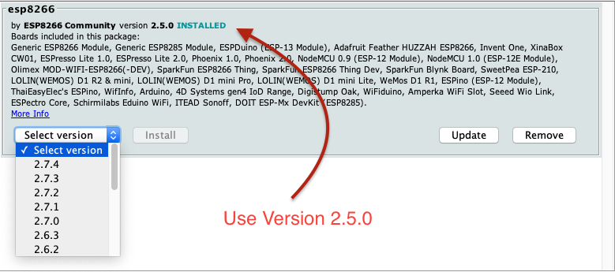
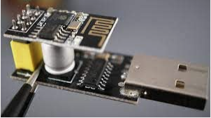

# ESP8266 (ESP-01)The ESP8266 is a low-cost Wi-Fi microchip, with a full TCP/IP stack and microcontroller capability. 

Important note: 
- Use Board Manager Module ESP8266 (version: 2.5.0)  Tools->Board->Board Manager

- Remove GPIO 0 from ground after loading sketch
- Use RST to reset/restart when necessary

## ESP8288 (ESP-01) pin configuration

## Recomendation
Use on of this ESP8266 ESP-01 USB Serial Programmer, it's easier, faster than Arduino based board.

