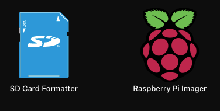

## Setup a Headless Pi 
# On Your MAC. 


1. Install SD Card formatter and Raspberry pi imager on you mac
2. Prepare SD card with desired OS and create following two files to root of SD card

- https://www.raspberrypi.org/documentation/configuration/wireless/headless.md
- also add an empty file name `ssh`

## Install. 
MQTT Broker and add Strong password

## IMPORTANT:  
Remove default `pi` user name and add new user and strong password

Remove password recovery process
http://mapledyne.com/ideas/2015/8/4/reset-lost-admin-password-for-raspberry-pi


## NODE_RED.  
Play with the idea of node-red
https://nodered.org/docs/


## Always Keep a Backup. 
###  1. Find the name of your SD card
$ diskutil list
(/dev/disk1)

## 2. Make and compress image file of the SD card
```
sudo dd if=/dev/rdisk1 bs=1m | gzip > /Users/Yourname/Desktop/pi.gz
```
## Command to make image file without compression:
```
$ sudo dd if=/dev/rdisk1 of=/Users/Yourname/Desktop/pi.img bs=1m
```

## 3. Unmount SD card (not eject)
```
diskutil unmountDisk /dev/disk1
```

## 4. Reflash the SD card
```
$ gzip -dc /User/Yourname/Desktop/pi.gz | sudo dd of=/dev/rdisk1 bs1m
```


